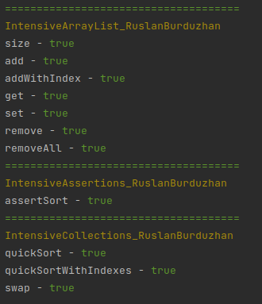

# intensive_36

# Описание проекта

Этот проект реализует несколько функций и алгоритмов для работы с динамическим массивом и сортировкой.

## Задачи

### Задача 1.1: Реализация своего динамического массива

- Класс IntensiveArrayList_RuslanBurduzhan в пакете task_1_1.impl реализует интерфейс task_1_1.IntensiveList.
- Реализованы методы интерфейса.
- Код класса и публичных методов должен быть задокументирован с использованием javadoc.
- Запрещено копирование реализации ArrayList из пакета java.util.

### Задача 1.2: Реализация алгоритма QuickSort

- Класс IntensiveCollections_RuslanBurduzhan в пакете task_1_2.impl реализует статический метод quickSort, который
  принимает и возвращает интерфейс IntensiveList.
- Используются Generics, Comparable и Comparator.

### Задача 1.3: Проверка отсортированности списка

- Класс IntensiveAssertions_RuslanBurduzhan в пакете task_1_3.impl реализует статический метод assertSort, который
  принимает интерфейс IntensiveList и возвращает boolean (true - список отсортирован, false - не отсортирован).

## Пример использования

Пример использования класса IntensiveArrayList_RuslanBurduzhan :

```
IntensiveArrayList_RuslanBurduzhan<String> list = new IntensiveArrayList_RuslanBurduzhan<>();

// Добавление элементов в список
list.add("apple");
list.add("banana");
list.add("cherry");

// Получение размера списка
int size = list.size(); // Результат: 3

// Получение элемента по индексу
String element = list.get(1); // Результат: "banana"

// Изменение элемента по индексу
String replacedElement = list.set(2, "grape"); // Результат: "cherry"

// Удаление элемента по индексу
String removedElement = list.remove(0); // Результат: "apple"

// Очистка списка
list.removeAll(); // Теперь список пустой

// Создание стрима из списка
Stream<String> stream = list.stream();
```

Пример использования класса IntensiveCollections_RuslanBurduzhan :

```
IntensiveArrayList_RuslanBurduzhan<Integer> list = new IntensiveArrayList_RuslanBurduzhan<>();
// Заполнение списка

IntensiveCollections_RuslanBurduzhan.quickSort(list);
// или
IntensiveCollections_RuslanBurduzhan.quickSort(list, 0, list.size() - 1);
```

Пример использования класса IntensiveAssertions_RuslanBurduzhan :

```
IntensiveArrayList_RuslanBurduzhan<Integer> list = new IntensiveArrayList_RuslanBurduzhan<>();
// Заполнение списка

boolean isSorted = IntensiveAssertions_RuslanBurduzhan.assertSort(list);
if (isSorted) {
    System.out.println("Список отсортирован");
} else {
    System.out.println("Список не отсортирован");
}
```

Вывод тестов в консоль по запуску `TestRunner.runTest();`:


